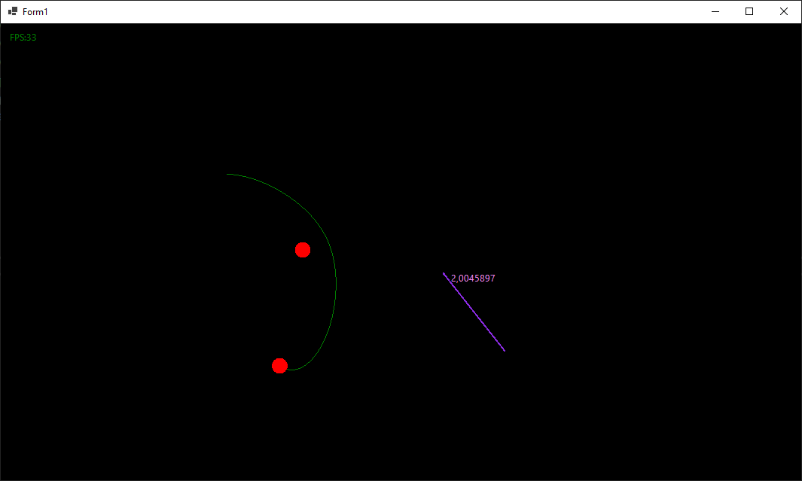
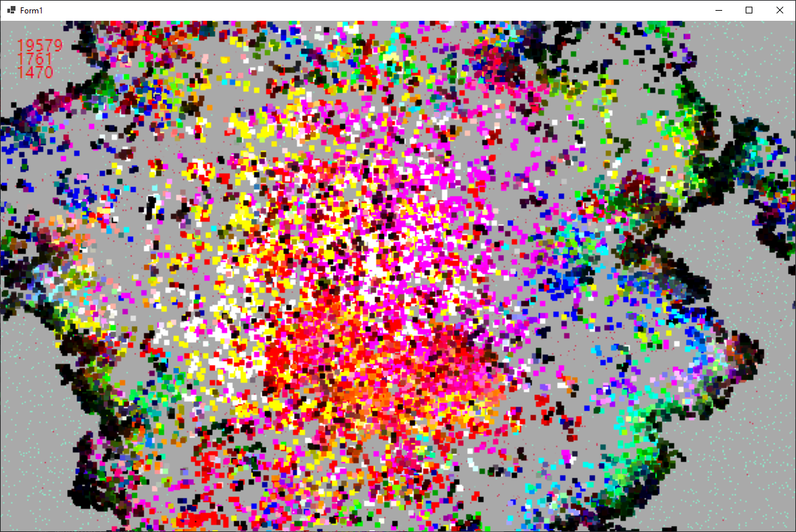

# Streams
*WARNING! Качество кода в данных проектах на последнем месте. Главная цель: сделать что-то прикольное*
## Planets
Симулятор движения планет.
Из школьной физики мы можем вспомнить, что сила притяжения между двумя телами прямопропорциональна(`пп`) произведению их масс и оратнопропорциональна(`оп`) квадрату расстояния между ними.

Ускорение тела `пп` силе и `оп` его массе:

Подставив и посокращав всё мы получаем:

Теперь мы можем запускать планеты в космос.

## Artificial Life
Искуственная жизнь в виде бактерий
Каждая бактерия имеет свой геном, который определяет её поведение(и цвет)
Когда бактерия съест достаточно еды - она даёт потомство, которое содержит мутации.
Соответственно, поведение потомства немного отличается от поведения родителя

